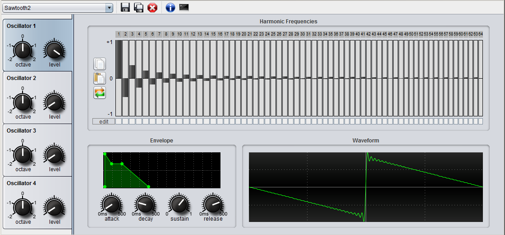

Syn-Thesis is an additive VST synthesizer with 4 oscillators. The waveform of each oscillator can be created by adding up to 64 harmonic frequencies. Syn-Thesis is based on the jVSTwRapper and can be used as VST plugin.

